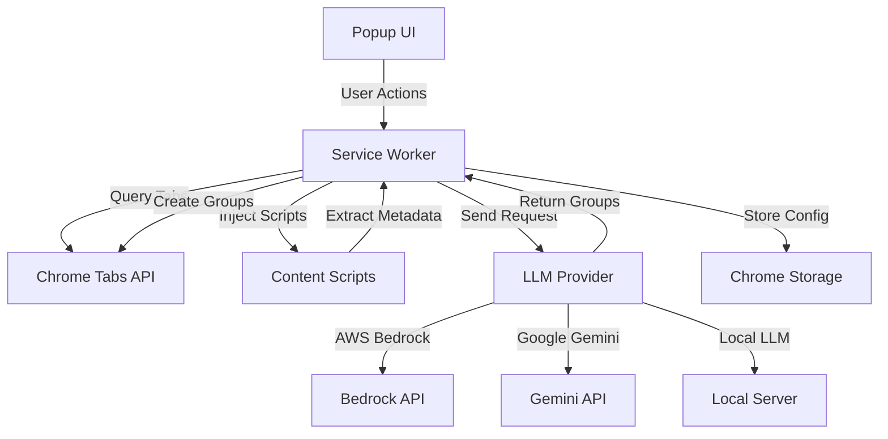

# Design Document

## Overview

The LLM Tab Grouper is a Chrome extension that uses AI to intelligently organize browser tabs. The architecture follows Chrome's extension manifest V3 specifications with a service worker for background processing, a popup UI for user interaction, and content scripts for tab metadata extraction. The extension integrates with AWS Bedrock, Google Gemini, or local LLM servers (OpenAI-compatible API) to perform LLM-based reasoning for tab classification.

## Architecture

### High-Level Architecture



### Component Breakdown

1. **Popup UI**: Simple HTML/CSS/JS interface for user interaction
2. **Service Worker**: Background script handling business logic and API communication
3. **Content Scripts**: Injected scripts for extracting page content from tabs
4. **LLM Provider Module**: Abstraction layer for AWS Bedrock and Google Gemini APIs
5. **Storage Manager**: Handles secure credential storage and configuration
6. **Tab Manager**: Interfaces with Chrome Tabs API for grouping operations

## Components and Interfaces

### 1. Popup UI Component

**Files**: `popup.html`, `popup.css`, `popup.js`

**Responsibilities**:
- Display configuration status
- Provide action buttons (Auto Group, Custom Group, Configure)
- Show loading states and operation results
- Handle user input for custom prompts

**Interface**:
```javascript
// Messages sent to service worker
{
  action: 'autoGroup' | 'customGroup' | 'getConfig' | 'saveConfig',
  data?: {
    prompt?: string,
    provider?: 'bedrock' | 'gemini',
    credentials?: object
  }
}

// Messages received from service worker
{
  success: boolean,
  message?: string,
  data?: {
    groupsCreated?: number,
    config?: object
  }
}
```

### 2. Service Worker Component

**File**: `background.js`

**Responsibilities**:
- Coordinate tab grouping operations
- Manage communication between components
- Handle LLM API requests
- Process grouping results and create tab groups
- Manage error handling and retries

**Key Functions**:
```javascript
async function handleAutoGroup()
async function handleCustomGroup(prompt)
async function collectTabMetadata()
async function sendToLLM(metadata, customPrompt)
async function applyGrouping(groupingResult)
async function getConfig()
async function saveConfig(config)
```

### 3. Content Script Component

**File**: `content.js`

**Responsibilities**:
- Extract page title and URL
- Extract text preview from page content
- Handle extraction errors gracefully
- Respect page permissions

**Interface**:
```javascript
// Message from service worker
{ action: 'extractContent' }

// Response to service worker
{
  title: string,
  url: string,
  contentPreview: string,
  error?: string
}
```

### 4. LLM Provider Module

**File**: `llm-provider.js`

**Responsibilities**:
- Abstract LLM API differences
- Format requests for each provider
- Parse responses into standard format
- Handle provider-specific errors

**Interface**:
```javascript
class LLMProvider {
  async groupTabs(tabMetadata, customPrompt)
  // Returns: { groups: [{ name: string, color: string, tabIndices: number[] }] }
}

class BedrockProvider extends LLMProvider {
  constructor(accessKey, secretKey, region)
  async groupTabs(tabMetadata, customPrompt)
}

class GeminiProvider extends LLMProvider {
  constructor(apiKey)
  async groupTabs(tabMetadata, customPrompt)
}

class LocalLLMProvider extends LLMProvider {
  constructor(endpoint, apiKey)
  async groupTabs(tabMetadata, customPrompt)
}
```

### 5. Storage Manager Component

**File**: `storage-manager.js`

**Responsibilities**:
- Securely store and retrieve credentials
- Manage configuration settings
- Handle storage errors

**Interface**:
```javascript
async function saveCredentials(provider, credentials)
async function getCredentials()
async function clearCredentials()
async function getConfig()
async function saveConfig(config)
```

### 6. Tab Manager Component

**File**: `tab-manager.js`

**Responsibilities**:
- Query all open tabs
- Create tab groups with names and colors
- Move tabs to groups
- Handle Chrome API errors

**Interface**:
```javascript
async function getAllTabs()
async function createGroup(name, color, tabIds)
async function ungroupTabs(tabIds)
```

## Data Models

### Configuration Object
```javascript
{
  provider: 'bedrock' | 'gemini' | 'local',
  credentials: {
    // For Bedrock
    accessKey?: string,
    secretKey?: string,
    region?: string,
    
    // For Gemini
    apiKey?: string,
    
    // For Local LLM
    endpoint?: string,  // e.g., http://localhost:11434/v1/chat/completions
    apiKey?: string     // Optional, for secured local servers
  },
  configured: boolean
}
```

### Tab Metadata Object
```javascript
{
  id: number,
  index: number,
  title: string,
  url: string,
  contentPreview: string,
  error?: string
}
```

### Grouping Result Object
```javascript
{
  groups: [
    {
      name: string,
      color: string,  // Chrome tab group color
      tabIndices: number[],
      reasoning?: string  // Optional explanation from LLM
    }
  ],
  ungrouped: number[]  // Indices of tabs that couldn't be grouped
}
```

### LLM Request Format
```javascript
{
  systemPrompt: string,  // Instructions for grouping behavior
  userPrompt?: string,   // Custom user instructions
  tabs: [
    {
      index: number,
      title: string,
      url: string,
      content: string
    }
  ]
}
```

### LLM Response Format (Expected)
```javascript
{
  groups: [
    {
      name: string,
      tabIndices: number[],
      reasoning: string
    }
  ]
}
```

## Error Handling

### Error Categories

1. **Configuration Errors**
   - Missing or invalid credentials
   - Unsupported provider selection
   - Storage access failures

2. **API Errors**
   - Network timeouts
   - Rate limiting
   - Authentication failures
   - Malformed responses

3. **Chrome API Errors**
   - Permission denied for tab access
   - Tab group creation failures
   - Content script injection failures

### Error Handling Strategy

```javascript
// Retry logic for API calls
async function callWithRetry(fn, maxRetries = 2) {
  for (let i = 0; i <= maxRetries; i++) {
    try {
      return await fn();
    } catch (error) {
      if (i === maxRetries) throw error;
      await sleep(1000 * (i + 1));  // Exponential backoff
    }
  }
}

// User-friendly error messages
const ERROR_MESSAGES = {
  'INVALID_CREDENTIALS': 'Your API credentials are invalid. Please check your settings.',
  'RATE_LIMIT': 'API rate limit exceeded. Please wait a moment and try again.',
  'NETWORK_ERROR': 'Network error occurred. Please check your connection.',
  'PERMISSION_DENIED': 'Cannot access some tabs. Chrome system pages are not accessible.',
  'LLM_ERROR': 'The AI service encountered an error. Please try again.'
};
```

## Testing Strategy

### Unit Tests

1. **LLM Provider Module**
   - Test request formatting for both providers
   - Test response parsing
   - Test error handling for various API errors
   - Mock API responses

2. **Storage Manager**
   - Test credential encryption/decryption
   - Test configuration persistence
   - Test error handling for storage failures

3. **Tab Manager**
   - Test tab querying
   - Test group creation
   - Test error handling for Chrome API failures

### Integration Tests

1. **End-to-End Auto Grouping**
   - Open multiple tabs with different content
   - Trigger auto grouping
   - Verify groups are created correctly
   - Verify tabs are moved to appropriate groups

2. **Custom Prompt Grouping**
   - Open tabs with known content
   - Provide specific grouping instructions
   - Verify groups match user intent

3. **Configuration Flow**
   - Test saving Bedrock credentials
   - Test saving Gemini credentials
   - Test switching between providers
   - Test credential validation

### Manual Testing Scenarios

1. **Large Tab Count**: Test with 50+ tabs to verify batching
2. **Mixed Tab Types**: Test with regular pages, chrome:// pages, and restricted pages
3. **Network Failures**: Test behavior with network disconnected
4. **Invalid Credentials**: Test error messages with wrong API keys
5. **Rate Limiting**: Test behavior when API limits are hit

## Implementation Notes

### Chrome Extension Manifest V3

The extension will use Manifest V3 with the following key permissions:
- `tabs`: Access to tab information
- `tabGroups`: Create and manage tab groups
- `storage`: Store configuration securely
- `scripting`: Inject content scripts
- `activeTab`: Access active tab content

### LLM Prompt Engineering

**System Prompt Template**:
```
You are a browser tab organization assistant. Analyze the provided tabs and group them into logical categories based on their content, purpose, and context.

Rules:
1. Create 2-7 groups maximum
2. Each group should have a clear, concise name (2-4 words)
3. Group tabs that share similar topics, domains, or purposes
4. Leave tabs ungrouped if they don't fit any category
5. Respond in JSON format only

{customPrompt}

Tabs to analyze:
{tabMetadata}

Respond with JSON in this format:
{
  "groups": [
    {
      "name": "Group Name",
      "tabIndices": [0, 2, 5],
      "reasoning": "Brief explanation"
    }
  ]
}
```

### AWS Bedrock Integration

- Use AWS SDK for JavaScript v3
- Support Claude models (claude-3-sonnet, claude-3-haiku)
- Use `bedrock-runtime` client for inference
- Handle AWS credential management securely

### Google Gemini Integration

- Use Gemini REST API
- Support Gemini Pro model
- Use API key authentication
- Handle JSON response parsing

### Local LLM Integration

- Support OpenAI-compatible API format (Ollama, LM Studio, LocalAI, etc.)
- Use `/v1/chat/completions` endpoint
- Support optional API key for secured servers
- Allow custom endpoint configuration (localhost or network)
- Handle both streaming and non-streaming responses
- Support common local models (Llama, Mistral, etc.)

### Security Considerations

1. **Credential Storage**: Use Chrome's `storage.local` with encryption
2. **Content Filtering**: Exclude password fields, credit card inputs
3. **HTTPS Only**: All API calls over secure connections
4. **Minimal Data**: Only send necessary metadata to LLM
5. **No Logging**: Avoid logging sensitive information

### Performance Optimizations

1. **Batching**: Process tabs in batches of 20 for large tab counts
2. **Caching**: Cache LLM responses for identical tab sets (optional future enhancement)
3. **Lazy Loading**: Only extract content when needed
4. **Debouncing**: Prevent rapid repeated grouping operations
