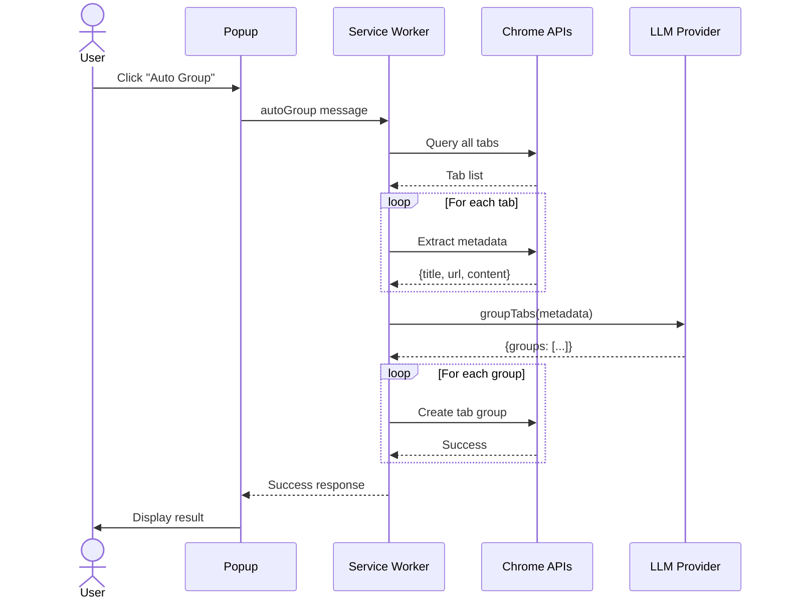
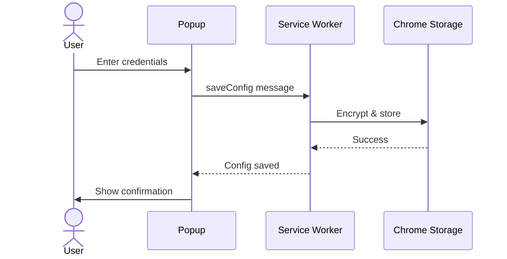

# Clutterless - Architecture Documentation

## Overview

Clutterless is a Chrome Extension (Manifest V3) that uses AI to intelligently organize browser tabs into logical groups. It integrates with AWS Bedrock, Google Gemini, or local LLM servers to analyze tab content and create meaningful groupings.

---

## High-Level Architecture

```
┌─────────────────────────────────────────────────────────────────┐
│                         Chrome Browser                          │
│                                                                 │
│  ┌──────────┐      ┌─────────────┐      ┌──────────┐          │
│  │ Popup UI │◄────►│   Service   │◄────►│ Content  │          │
│  │          │      │   Worker    │      │ Scripts  │          │
│  └──────────┘      └──────┬──────┘      └──────────┘          │
│                           │                                     │
│                    ┌──────▼──────┐                              │
│                    │ Chrome APIs │                              │
│                    │ Tabs/Groups │                              │
│                    └─────────────┘                              │
└─────────────────────────────────────────────────────────────────┘
                           │
                           │ HTTPS
                           ▼
        ┌──────────────────┴──────────────────┐
        │                                     │
   ┌────▼─────┐      ┌──────────┐      ┌─────▼──────┐
   │  Bedrock │      │  Gemini  │      │ Local LLM  │
   │ (Claude) │      │   (Pro)  │      │  (Ollama)  │
   └──────────┘      └──────────┘      └────────────┘
```

---

## Component Architecture

### 1. Popup UI (`popup/`)
- User interface for configuration and actions
- Displays status and results
- Sends messages to service worker

### 2. Service Worker (`background/background.js`)
- Coordinates all operations
- Manages LLM API communication
- Handles tab grouping logic
- Error handling and logging

### 3. Content Scripts (`content/content.js`)
- Extracts page metadata (title, URL, content preview)
- Injected into tabs when needed
- Handles restricted pages gracefully

### 4. Library Modules (`lib/`)
- **llm-provider.js**: Abstracts LLM APIs (Bedrock, Gemini, Local)
- **tab-manager.js**: Chrome Tabs/TabGroups API wrapper
- **storage-manager.js**: Secure credential storage
- **error-handler.js**: Error formatting and categorization
- **error-logger.js**: Logging utilities

---

## Sequence Diagrams

### Auto Group Flow



### Configuration Flow



---

## Data Flow

### Tab Metadata Collection

```
User Action
    │
    ▼
Query Tabs (chrome.tabs.query)
    │
    ▼
Extract Metadata (title, URL, content)
    │
    ▼
Format for LLM
    │
    ▼
Send to LLM Provider
    │
    ▼
Receive Grouping Result
    │
    ▼
Create Tab Groups (chrome.tabGroups)
```

### LLM Processing

```
Tab Metadata
    │
    ▼
Build System Prompt
    │
    ▼
Provider-Specific API Call
  ┌─────┼─────┐
  │     │     │
Bedrock Gemini Local
  │     │     │
  └─────┼─────┘
    │
    ▼
Parse & Validate Response
    │
    ▼
Return Groups with Colors
```

---

## Security Architecture

### Credential Management
1. **Input Validation**: Sanitize and validate all inputs
2. **Chrome Storage**: Encrypted storage via `chrome.storage.local`
3. **HTTPS Only**: All API calls over TLS
4. **Content Filtering**: Exclude sensitive data (passwords, credit cards)
5. **Permission Boundaries**: Minimal required permissions

### Data Privacy
- Only sends: Tab title, URL, content preview (first 500 chars)
- Excludes: Passwords, credit cards, cookies, session data
- Local processing: Groups created locally, no data sent back

---

## Technology Stack

**Frontend**: HTML5, CSS3, Vanilla JavaScript  
**Extension**: Chrome Manifest V3, Service Workers, Content Scripts  
**APIs**: Chrome Tabs, TabGroups, Storage, Scripting  
**LLM Providers**: AWS Bedrock (Claude), Google Gemini, Local LLM (OpenAI-compatible)  
**Testing**: Vitest, jsdom  

---

## Project Structure

```
clutterless/
├── manifest.json           # Extension configuration
├── popup/                  # UI components
│   ├── popup.html
│   ├── popup.css
│   └── popup.js
├── background/             # Service worker
│   └── background.js
├── content/                # Content scripts
│   └── content.js
├── lib/                    # Core libraries
│   ├── llm-provider.js
│   ├── tab-manager.js
│   ├── storage-manager.js
│   ├── error-handler.js
│   └── error-logger.js
├── tests/                  # Test suites
├── icons/                  # Extension icons
└── examples/               # Config examples
```

---

## Performance

### Optimization Strategies
- **Batch Processing**: Handle 20 tabs at a time
- **Lazy Loading**: Extract content only when needed
- **Compact Prompts**: Minimal token usage
- **Fast Models**: Use Haiku for speed

### Target Metrics
- Metadata Collection: < 2 seconds
- LLM API Call: 3-8 seconds
- Group Creation: < 1 second
- **Total**: 5-12 seconds

---

## Error Handling

### Error Categories
1. **Configuration**: Missing/invalid credentials
2. **API**: Network, rate limits, authentication
3. **Chrome API**: Permission denied, tab access
4. **Content**: Script injection failures

### Retry Strategy
- Automatic retry with exponential backoff (1s, 2s)
- User-friendly error messages
- Graceful degradation for restricted tabs

---

## API Endpoints

**AWS Bedrock**
- Endpoint: `bedrock-runtime.{region}.amazonaws.com`
- Models: Claude 3 Sonnet, Claude 3 Haiku

**Google Gemini**
- Endpoint: `https://generativelanguage.googleapis.com`
- Model: Gemini Pro

**Local LLM**
- Endpoint: `http://localhost:11434/v1/chat/completions` (Ollama)
- Format: OpenAI-compatible

---

**Version**: 1.0  
**Repository**: https://github.com/srikanthjg/Clutterless
