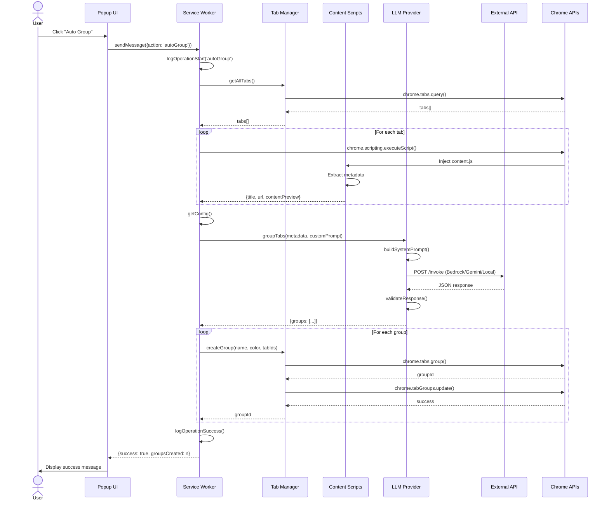
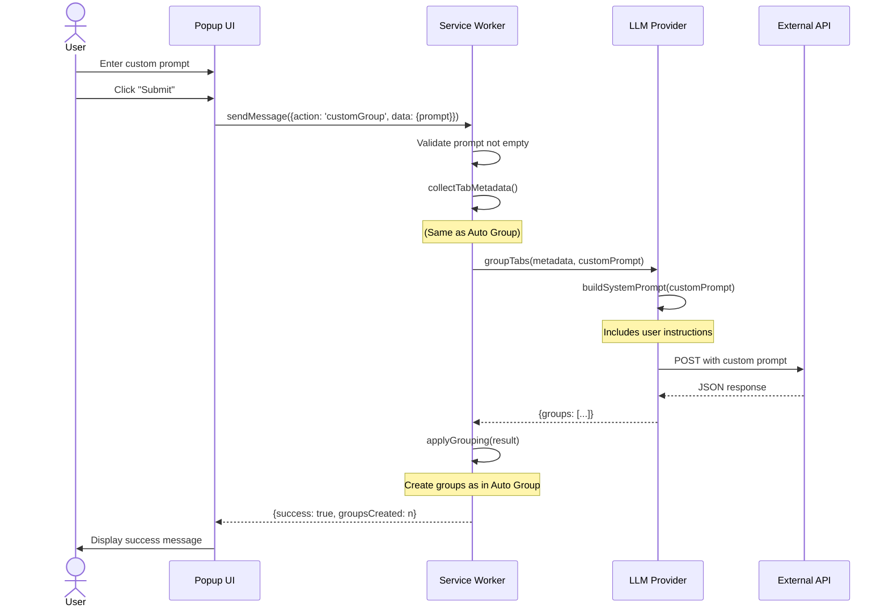
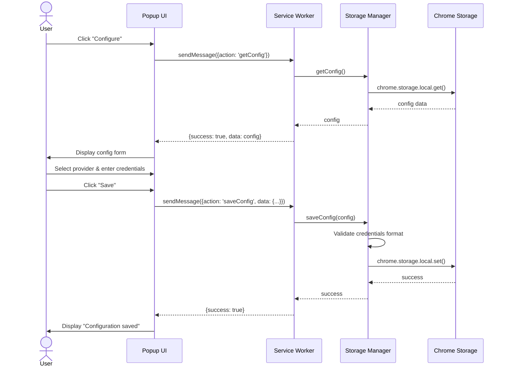
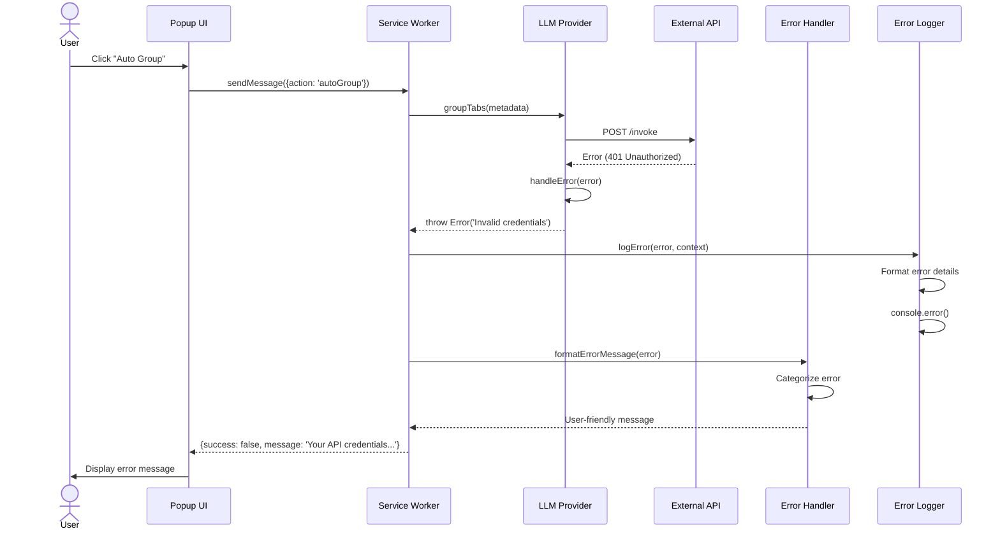

# LLM Tab Grouper - Architecture Documentation

## Table of Contents
1. [System Overview](#system-overview)
2. [High-Level Architecture](#high-level-architecture)
3. [Component Architecture](#component-architecture)
4. [Sequence Diagrams](#sequence-diagrams)
5. [Data Flow](#data-flow)
6. [Technology Stack](#technology-stack)

---

## System Overview

The LLM Tab Grouper is a Chrome Extension (Manifest V3) that uses AI to intelligently organize browser tabs into logical groups. The system integrates with multiple LLM providers (AWS Bedrock, Google Gemini, or local LLM servers) to analyze tab content and create meaningful groupings.

### Key Features
- **Multi-Provider Support**: AWS Bedrock, Google Gemini, Local LLM (Ollama, LM Studio)
- **Automatic Grouping**: AI-driven tab organization based on content analysis
- **Custom Prompts**: User-defined grouping instructions
- **Secure Storage**: Encrypted credential management
- **Batch Processing**: Efficient handling of 50+ tabs

---

## High-Level Architecture

### System Context Diagram (ASCII)

```
┌─────────────────────────────────────────────────────────────────────┐
│                         Chrome Browser                              │
│                                                                     │
│  ┌──────────────┐      ┌─────────────────┐      ┌──────────────┐  │
│  │              │      │                 │      │              │  │
│  │  Popup UI    │◄────►│ Service Worker  │◄────►│   Content    │  │
│  │  (popup.js)  │      │ (background.js) │      │   Scripts    │  │
│  │              │      │                 │      │ (content.js) │  │
│  └──────────────┘      └────────┬────────┘      └──────────────┘  │
│                                 │                                  │
│                                 │                                  │
│                        ┌────────▼────────┐                         │
│                        │                 │                         │
│                        │  Chrome APIs    │                         │
│                        │  - Tabs         │                         │
│                        │  - TabGroups    │                         │
│                        │  - Storage      │                         │
│                        │  - Scripting    │                         │
│                        └─────────────────┘                         │
└─────────────────────────────────────────────────────────────────────┘
                                 │
                                 │ HTTPS
                                 │
                ┌────────────────┴────────────────┐
                │                                 │
                │                                 │
    ┌───────────▼──────────┐        ┌────────────▼─────────┐
    │                      │        │                      │
    │   AWS Bedrock API    │        │  Google Gemini API   │
    │   (Claude Models)    │        │   (Gemini Pro)       │
    │                      │        │                      │
    └──────────────────────┘        └──────────────────────┘
                │
                │
    ┌───────────▼──────────┐
    │                      │
    │   Local LLM Server   │
    │  (Ollama/LM Studio)  │
    │                      │
    └──────────────────────┘
```

---

## Component Architecture

### Component Diagram (ASCII)

```
┌─────────────────────────────────────────────────────────────────────────┐
│                        LLM Tab Grouper Extension                        │
├─────────────────────────────────────────────────────────────────────────┤
│                                                                         │
│  ┌─────────────────────────────────────────────────────────────────┐   │
│  │                        Presentation Layer                       │   │
│  │                                                                 │   │
│  │  ┌──────────────────────────────────────────────────────────┐  │   │
│  │  │  Popup UI (popup.html, popup.css, popup.js)             │  │   │
│  │  │  - Configuration Form                                    │  │   │
│  │  │  - Action Buttons (Auto Group, Custom Group)            │  │   │
│  │  │  - Status Display                                        │  │   │
│  │  └──────────────────────────────────────────────────────────┘  │   │
│  └─────────────────────────────────────────────────────────────────┘   │
│                                  │                                      │
│                                  │ chrome.runtime.sendMessage()         │
│                                  ▼                                      │
│  ┌─────────────────────────────────────────────────────────────────┐   │
│  │                      Business Logic Layer                       │   │
│  │                                                                 │   │
│  │  ┌──────────────────────────────────────────────────────────┐  │   │
│  │  │  Service Worker (background.js)                          │  │   │
│  │  │  - Message Router                                        │  │   │
│  │  │  - Operation Coordinator                                 │  │   │
│  │  │  - Error Handler                                         │  │   │
│  │  └──────────────────────────────────────────────────────────┘  │   │
│  └─────────────────────────────────────────────────────────────────┘   │
│                                  │                                      │
│                                  │                                      │
│                                  ▼                                      │
│  ┌─────────────────────────────────────────────────────────────────┐   │
│  │                      Service/Library Layer                      │   │
│  │                                                                 │   │
│  │  ┌──────────────┐  ┌──────────────┐  ┌──────────────────────┐ │   │
│  │  │              │  │              │  │                      │ │   │
│  │  │ Tab Manager  │  │   Storage    │  │   LLM Provider       │ │   │
│  │  │              │  │   Manager    │  │   - BedrockProvider  │ │   │
│  │  │ - getAllTabs │  │              │  │   - GeminiProvider   │ │   │
│  │  │ - createGroup│  │ - saveConfig │  │   - LocalLLMProvider │ │   │
│  │  │ - ungroupTabs│  │ - getConfig  │  │                      │ │   │
│  │  │              │  │ - saveCreds  │  │   - groupTabs()      │ │   │
│  │  │              │  │ - getCreds   │  │   - buildPrompt()    │ │   │
│  │  └──────────────┘  └──────────────┘  └──────────────────────┘ │   │
│  │                                                                 │   │
│  │  ┌──────────────┐  ┌──────────────┐                           │   │
│  │  │              │  │              │                           │   │
│  │  │Error Handler │  │Error Logger  │                           │   │
│  │  │              │  │              │                           │   │
│  │  │ - format     │  │ - logError   │                           │   │
│  │  │ - categorize │  │ - logWarning │                           │   │
│  │  │              │  │ - logSuccess │                           │   │
│  │  └──────────────┘  └──────────────┘                           │   │
│  └─────────────────────────────────────────────────────────────────┘   │
│                                  │                                      │
│                                  │                                      │
│                                  ▼                                      │
│  ┌─────────────────────────────────────────────────────────────────┐   │
│  │                    Content Extraction Layer                     │   │
│  │                                                                 │   │
│  │  ┌──────────────────────────────────────────────────────────┐  │   │
│  │  │  Content Scripts (content.js)                            │  │   │
│  │  │  - Extract page title                                    │  │   │
│  │  │  - Extract page URL                                      │  │   │
│  │  │  - Extract content preview                               │  │   │
│  │  └──────────────────────────────────────────────────────────┘  │   │
│  └─────────────────────────────────────────────────────────────────┘   │
│                                                                         │
└─────────────────────────────────────────────────────────────────────────┘
```

### Module Dependency Graph

```
popup.js
    │
    └──► background.js (Service Worker)
            │
            ├──► tab-manager.js
            │       └──► Chrome Tabs API
            │       └──► Chrome TabGroups API
            │
            ├──► storage-manager.js
            │       └──► Chrome Storage API
            │
            ├──► llm-provider.js
            │       ├──► BedrockProvider
            │       │       └──► AWS Bedrock API
            │       ├──► GeminiProvider
            │       │       └──► Google Gemini API
            │       └──► LocalLLMProvider
            │               └──► Local LLM Server
            │
            ├──► error-handler.js
            │
            └──► error-logger.js

content.js (injected into tabs)
    └──► DOM API (page content extraction)
```

---

## Sequence Diagrams

### 1. Auto Group Flow



### 2. Custom Group Flow



### 3. Configuration Flow



### 4. Error Handling Flow



---

## Data Flow

### Tab Metadata Collection Flow

```
┌──────────────┐
│  User Action │
└──────┬───────┘
       │
       ▼
┌──────────────────────────────────────────────────────────────┐
│ 1. Query All Tabs                                            │
│    chrome.tabs.query({currentWindow: true})                  │
│    Returns: [{id, title, url, index}, ...]                   │
└──────┬───────────────────────────────────────────────────────┘
       │
       ▼
┌──────────────────────────────────────────────────────────────┐
│ 2. Inject Content Scripts (for each tab)                     │
│    chrome.scripting.executeScript({                          │
│      target: {tabId},                                         │
│      files: ['content/content.js']                           │
│    })                                                         │
└──────┬───────────────────────────────────────────────────────┘
       │
       ▼
┌──────────────────────────────────────────────────────────────┐
│ 3. Extract Content (in each tab)                             │
│    - document.title                                           │
│    - window.location.href                                     │
│    - document.body.innerText.substring(0, 500)               │
└──────┬───────────────────────────────────────────────────────┘
       │
       ▼
┌──────────────────────────────────────────────────────────────┐
│ 4. Aggregate Metadata                                         │
│    [{                                                         │
│      id: 123,                                                 │
│      index: 0,                                                │
│      title: "GitHub - Project",                              │
│      url: "https://github.com/...",                          │
│      contentPreview: "Repository for..."                     │
│    }, ...]                                                    │
└──────┬───────────────────────────────────────────────────────┘
       │
       ▼
┌──────────────────────────────────────────────────────────────┐
│ 5. Send to LLM Provider                                       │
└───────────────────────────────────────────────────────────────┘
```

### LLM Processing Flow

```
┌──────────────────────────────────────────────────────────────┐
│ Tab Metadata Input                                           │
│ [{index, title, url, contentPreview}, ...]                  │
└──────┬───────────────────────────────────────────────────────┘
       │
       ▼
┌──────────────────────────────────────────────────────────────┐
│ Build System Prompt                                           │
│ - Base instructions                                           │
│ - Custom user prompt (if provided)                           │
│ - JSON format specification                                   │
│ - Tab data formatted as text                                 │
└──────┬───────────────────────────────────────────────────────┘
       │
       ▼
┌──────────────────────────────────────────────────────────────┐
│ Provider-Specific API Call                                    │
│                                                               │
│ ┌─────────────┐  ┌─────────────┐  ┌─────────────────────┐  │
│ │  Bedrock    │  │   Gemini    │  │   Local LLM         │  │
│ │  AWS SDK    │  │   REST API  │  │   OpenAI-compatible │  │
│ │  Claude     │  │   Gemini Pro│  │   Ollama/LM Studio  │  │
│ └─────────────┘  └─────────────┘  └─────────────────────┘  │
└──────┬───────────────────────────────────────────────────────┘
       │
       ▼
┌──────────────────────────────────────────────────────────────┐
│ Parse & Validate Response                                     │
│ - Extract JSON from response                                  │
│ - Validate structure (groups array)                          │
│ - Validate each group (name, tabIndices)                     │
│ - Assign colors to groups                                     │
└──────┬───────────────────────────────────────────────────────┘
       │
       ▼
┌──────────────────────────────────────────────────────────────┐
│ Grouping Result                                               │
│ {                                                             │
│   groups: [                                                   │
│     {name: "Work", color: "blue", tabIndices: [0,2,5]},     │
│     {name: "Research", color: "green", tabIndices: [1,3]}   │
│   ]                                                           │
│ }                                                             │
└──────┬───────────────────────────────────────────────────────┘
       │
       ▼
┌──────────────────────────────────────────────────────────────┐
│ Apply Grouping (Chrome APIs)                                  │
│ - chrome.tabs.group({tabIds})                                │
│ - chrome.tabGroups.update({title, color})                    │
└───────────────────────────────────────────────────────────────┘
```

### Configuration Storage Flow

```
┌──────────────┐
│ User Input   │
│ Credentials  │
└──────┬───────┘
       │
       ▼
┌──────────────────────────────────────────────────────────────┐
│ Validate Configuration                                        │
│ - Check provider type                                         │
│ - Validate required fields                                    │
│ - Format credentials object                                   │
└──────┬───────────────────────────────────────────────────────┘
       │
       ▼
┌──────────────────────────────────────────────────────────────┐
│ Store in Chrome Storage                                       │
│ chrome.storage.local.set({                                    │
│   llmConfig: {                                                │
│     provider: 'bedrock',                                      │
│     credentials: {...},                                       │
│     configured: true                                          │
│   }                                                           │
│ })                                                            │
└──────┬───────────────────────────────────────────────────────┘
       │
       ▼
┌──────────────────────────────────────────────────────────────┐
│ Encrypted Storage (Chrome handles encryption)                │
│ - Stored in user profile directory                           │
│ - Encrypted at rest                                           │
│ - Accessible only to extension                               │
└───────────────────────────────────────────────────────────────┘
```

---

## Technology Stack

### Frontend
- **HTML5**: Popup UI structure
- **CSS3**: Styling and layout
- **Vanilla JavaScript**: UI logic and interactions

### Extension Framework
- **Chrome Extension Manifest V3**: Modern extension architecture
- **Service Workers**: Background processing
- **Content Scripts**: Page content extraction

### Chrome APIs Used
- `chrome.tabs`: Tab querying and management
- `chrome.tabGroups`: Tab group creation and updates
- `chrome.storage`: Secure credential storage
- `chrome.scripting`: Content script injection
- `chrome.runtime`: Message passing between components

### External APIs
- **AWS Bedrock**: Claude 3 models (Sonnet, Haiku)
- **Google Gemini**: Gemini Pro model
- **Local LLM**: OpenAI-compatible API (Ollama, LM Studio, LocalAI)

### Development Tools
- **Node.js**: Development environment
- **npm**: Package management
- **Jest**: Unit testing framework

### Libraries & Modules
- **ES6 Modules**: Code organization
- **Async/Await**: Asynchronous operations
- **Error Handling**: Custom error classes and handlers

---

## Security Architecture

### Credential Management

```
┌─────────────────────────────────────────────────────────────┐
│                    Security Layers                          │
├─────────────────────────────────────────────────────────────┤
│                                                             │
│  1. Input Validation                                        │
│     - Validate credential format                            │
│     - Sanitize user input                                   │
│     - Check required fields                                 │
│                                                             │
│  2. Chrome Storage Encryption                               │
│     - chrome.storage.local (encrypted at rest)              │
│     - Accessible only to extension                          │
│     - Isolated from web pages                               │
│                                                             │
│  3. HTTPS-Only Communication                                │
│     - All API calls over TLS                                │
│     - Certificate validation                                │
│     - No plaintext transmission                             │
│                                                             │
│  4. Content Filtering                                       │
│     - Exclude password fields                               │
│     - Exclude credit card inputs                            │
│     - Exclude sensitive form data                           │
│     - Only send necessary metadata                          │
│                                                             │
│  5. Permission Boundaries                                   │
│     - Minimal required permissions                          │
│     - No access to chrome:// pages                          │
│     - No access to extension pages                          │
│     - Respects Chrome security model                        │
│                                                             │
└─────────────────────────────────────────────────────────────┘
```

### Data Privacy Flow

```
Tab Content
    │
    ├─► Title (public metadata) ──────────┐
    ├─► URL (public metadata) ────────────┤
    ├─► Content Preview (first 500 chars) ┤──► Sent to LLM
    │                                      │
    └─► EXCLUDED:                          │
        - Password fields                  │
        - Credit card inputs               │
        - Hidden form data                 │
        - Cookies                          │
        - Local storage                    │
        - Session data                     │
                                           │
                                           ▼
                                    LLM Provider
                                    (Processes & Returns Groups)
                                           │
                                           ▼
                                    Chrome Tab Groups
                                    (Local only, no data sent)
```

---

## Performance Considerations

### Optimization Strategies

1. **Batch Processing**
   - Process tabs in batches of 20 for large tab counts
   - Prevents API timeouts and rate limiting
   - Improves user experience with progress feedback

2. **Lazy Content Extraction**
   - Only extract content when needed
   - Skip chrome:// and restricted pages
   - Handle extraction errors gracefully

3. **Caching Strategy** (Future Enhancement)
   - Cache LLM responses for identical tab sets
   - Reduce API calls and costs
   - Improve response time for repeated operations

4. **Debouncing**
   - Prevent rapid repeated grouping operations
   - Protect against accidental double-clicks
   - Reduce unnecessary API calls

### Performance Metrics

```
Operation                    Target Time
─────────────────────────────────────────
Tab Metadata Collection      < 2 seconds
LLM API Call                 3-8 seconds
Group Creation               < 1 second
Total Auto Group Operation   5-12 seconds
```

---

## Error Handling Architecture

### Error Categories & Handling

```
┌─────────────────────────────────────────────────────────────┐
│                    Error Taxonomy                           │
├─────────────────────────────────────────────────────────────┤
│                                                             │
│  Configuration Errors                                       │
│  ├─► Missing credentials ──► Prompt user to configure      │
│  ├─► Invalid credentials ──► Show validation error         │
│  └─► Unsupported provider ─► Show provider options         │
│                                                             │
│  API Errors                                                 │
│  ├─► Network timeout ──────► Retry with backoff            │
│  ├─► Rate limiting ────────► Show wait message             │
│  ├─► Authentication ───────► Prompt credential update      │
│  └─► Malformed response ───► Log & show generic error      │
│                                                             │
│  Chrome API Errors                                          │
│  ├─► Permission denied ────► Explain restrictions          │
│  ├─► Tab access failed ────► Skip tab, continue            │
│  └─► Group creation failed ─► Retry or show error          │
│                                                             │
│  Content Extraction Errors                                  │
│  ├─► Script injection failed ──► Skip tab                  │
│  ├─► Restricted page ──────────► Skip tab                  │
│  └─► Timeout ──────────────────► Use fallback metadata     │
│                                                             │
└─────────────────────────────────────────────────────────────┘
```

### Retry Logic

```
API Call Attempt
    │
    ├─► Success ──────────────────────────► Return Result
    │
    └─► Failure
        │
        ├─► Retry 1 (wait 1s) ──► Success ──► Return Result
        │                      └─► Failure
        │                          │
        └─────────────────────────►├─► Retry 2 (wait 2s) ──► Success ──► Return Result
                                   │                      └─► Failure
                                   │                          │
                                   └──────────────────────────► Throw Error
                                                                (Show user message)
```

---

## Deployment Architecture

### Extension Package Structure

```
llm-tab-grouper/
├── manifest.json              # Extension configuration
├── popup/
│   ├── popup.html            # UI structure
│   ├── popup.css             # Styling
│   └── popup.js              # UI logic
├── background/
│   └── background.js         # Service worker
├── content/
│   └── content.js            # Content scripts
├── lib/
│   ├── llm-provider.js       # LLM abstraction
│   ├── storage-manager.js    # Storage operations
│   ├── tab-manager.js        # Tab operations
│   ├── error-handler.js      # Error formatting
│   └── error-logger.js       # Logging utilities
├── icons/
│   ├── icon16.png
│   ├── icon48.png
│   └── icon128.png
└── examples/
    ├── bedrock-config.example.json
    ├── gemini-config.example.json
    └── ollama-config.example.json
```

### Installation Flow

```
Developer                Chrome Browser
    │                         │
    │  1. Load Extension       │
    ├──────────────────────────►
    │                         │
    │                    2. Parse manifest.json
    │                         │
    │                    3. Register service worker
    │                         │
    │                    4. Grant permissions
    │                         │
    │  5. Extension Ready      │
    ◄──────────────────────────┤
    │                         │
    │  6. Click icon           │
    ├──────────────────────────►
    │                         │
    │                    7. Show popup.html
    │                         │
    │  8. Configure provider   │
    ├──────────────────────────►
    │                         │
    │                    9. Store credentials
    │                         │
    │  10. Ready to use        │
    ◄──────────────────────────┤
```

---

## Future Architecture Enhancements

### Planned Improvements

1. **Response Caching**
   - Cache LLM responses for identical tab sets
   - Implement cache invalidation strategy
   - Reduce API costs and improve speed

2. **Background Auto-Grouping**
   - Periodic automatic grouping
   - Configurable intervals
   - Smart detection of new tabs

3. **Group Templates**
   - Save and reuse grouping patterns
   - Share templates between users
   - Import/export functionality

4. **Analytics Dashboard**
   - Track grouping patterns
   - Show productivity metrics
   - Visualize tab organization trends

5. **Multi-Window Support**
   - Group tabs across multiple windows
   - Sync groups between windows
   - Window-specific grouping rules

6. **Advanced Filtering**
   - Exclude specific domains
   - Custom content extraction rules
   - Regex-based tab matching

---

## Appendix

### Message Passing Protocol

```javascript
// Popup → Service Worker
{
  action: 'autoGroup' | 'customGroup' | 'getConfig' | 'saveConfig' | 'clearConfig',
  data?: {
    prompt?: string,
    provider?: 'bedrock' | 'gemini' | 'local',
    credentials?: {
      // Provider-specific fields
    }
  }
}

// Service Worker → Popup
{
  success: boolean,
  message?: string,
  data?: {
    groupsCreated?: number,
    config?: object,
    error?: string
  }
}

// Service Worker → Content Script
{
  action: 'extractContent'
}

// Content Script → Service Worker
{
  title: string,
  url: string,
  contentPreview: string,
  error?: string
}
```

### Color Mapping

```javascript
const CHROME_COLORS = [
  'grey',   // Default/Miscellaneous
  'blue',   // Work/Professional
  'red',    // Urgent/Important
  'yellow', // Research/Learning
  'green',  // Personal/Leisure
  'pink',   // Social/Communication
  'purple', // Creative/Design
  'cyan',   // Development/Technical
  'orange'  // Shopping/Commerce
];
```

### API Endpoints

```
AWS Bedrock:
  Region: us-east-1, us-west-2, etc.
  Endpoint: bedrock-runtime.{region}.amazonaws.com
  Method: POST /model/{modelId}/invoke
  Models: anthropic.claude-3-sonnet-20240229-v1:0
          anthropic.claude-3-haiku-20240307-v1:0

Google Gemini:
  Endpoint: https://generativelanguage.googleapis.com
  Method: POST /v1/models/gemini-pro:generateContent
  Auth: API Key in query parameter

Local LLM:
  Endpoint: http://localhost:11434/v1/chat/completions (Ollama)
            http://localhost:1234/v1/chat/completions (LM Studio)
  Method: POST
  Format: OpenAI-compatible
  Auth: Optional API key in header
```

---

**Document Version**: 1.0  
**Last Updated**: November 2024  
**Maintained By**: LLM Tab Grouper Development Team
