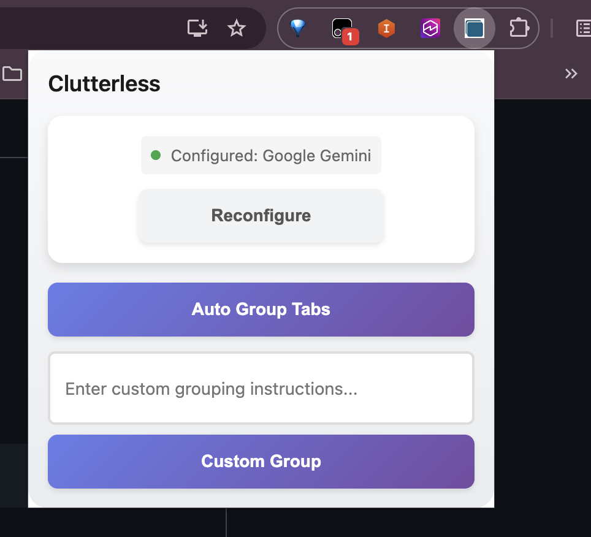

# Clutterless

A Chrome extension that uses AI to intelligently organize browser tabs into logical groups. Reduce tab clutter and improve productivity with automatic or custom-prompted tab organization powered by AWS Bedrock, Google Gemini, or local LLM models.

## Screenshot




## Features

- **Automatic Tab Grouping**: Let AI analyze and organize your tabs based on content and context
- **Custom Prompt Grouping**: Provide specific instructions for how you want tabs organized
- **Multiple LLM Providers**: Choose from AWS Bedrock, Google Gemini, or local LLM servers
- **Secure Credential Storage**: Your API keys are stored securely using Chrome's encrypted storage
- **Smart Metadata Extraction**: Intelligently extracts page titles, URLs, and content previews
- **Batch Processing**: Handles large numbers of tabs efficiently (50+ tabs)
- **Privacy-Focused**: Only sends necessary metadata to the LLM, excludes sensitive data
- **Modern UI Design**: Polished interface with rounded corners, gradients, smooth animations, and enhanced accessibility

## Installation

### From Source (Development)

1. **Clone the repository:**
   ```bash
   git clone https://github.com/srikanthjg/Clutterless.git
   cd Clutterless
   ```

2. **Build the extension:**
   ```bash
   npm install
   npm run build
   ```
   
   This creates a `dist/` folder with the bundled extension (~400KB with AWS SDK included).

3. **Load in Chrome:**
   - Open Chrome and navigate to `chrome://extensions/`
   - Enable "Developer mode" using the toggle in the top right
   - Click "Load unpacked"
   - **⚠️ CRITICAL: Navigate to and select the `dist/` folder** (not the root folder)
   
   ```
   ✅ CORRECT:   /path/to/Clutterless/dist/
   ❌ WRONG:     /path/to/Clutterless/
   ```

4. The Clutterless icon should appear in your Chrome toolbar

**Note:** After making code changes, rebuild with `npm run build` and reload the extension in Chrome.

For detailed build information, see [BUILD.md](BUILD.md).

## Configuration

Before using the extension, you need to configure your preferred LLM provider. Click the extension icon and select "Configure" to get started.

### Option 1: AWS Bedrock

AWS Bedrock provides access to Claude and other foundation models.

**Prerequisites:**
- AWS account with Bedrock access enabled
- IAM user with Bedrock permissions
- AWS credentials (Access Key ID and Secret Access Key)

**Setup Steps:**
1. Click the extension icon
2. Select "AWS Bedrock" as your provider
3. Enter your AWS credentials:
   - **Access Key ID**: Your AWS access key
     - Permanent credentials: `AKIA...` (20 characters)
     - Temporary credentials: `ASIA...` (20 characters, requires session token)
   - **Secret Access Key**: Your AWS secret key (40 characters)
   - **Session Token**: Required for temporary credentials (ASIA prefix)
   - **Region**: AWS region where Bedrock is available (e.g., `us-east-1`, `us-west-2`)
4. Click "Save Configuration"

**Supported Models:**
- Claude 3 Sonnet
- Claude 3 Haiku

**IAM Permissions Required:**
```json
{
  "Version": "2012-10-17",
  "Statement": [
    {
      "Effect": "Allow",
      "Action": [
        "bedrock:InvokeModel"
      ],
      "Resource": "arn:aws:bedrock:*::foundation-model/*"
    }
  ]
}
```

### Option 2: Google Gemini

Google Gemini provides powerful AI capabilities through a simple API.

**Prerequisites:**
- Google Cloud account
- Gemini API key

**Setup Steps:**
1. Get your API key from [Google AI Studio](https://makersuite.google.com/app/apikey)
2. Click the extension icon
3. Select "Google Gemini" as your provider
4. Enter your API key
5. Click "Save Configuration"

**Supported Models:**
- Gemini Pro

### Option 3: Local LLM

Run your own LLM locally using Ollama, LM Studio, or other OpenAI-compatible servers.

**Prerequisites:**
- Local LLM server running (Ollama, LM Studio, LocalAI, etc.)
- Server accessible via HTTP/HTTPS

**Setup Steps:**
1. Start your local LLM server (see examples below)
2. Click the extension icon
3. Select "Local LLM" as your provider
4. Enter your endpoint URL (e.g., `http://localhost:11434/v1/chat/completions`)
5. (Optional) Enter API key if your server requires authentication
6. Click "Save Configuration"

**Ollama Example:**
```bash
# Install Ollama from https://ollama.ai
# Pull a model
ollama pull llama3

# Ollama automatically provides OpenAI-compatible API at:
# http://localhost:11434/v1/chat/completions
```

**LM Studio Example:**
```bash
# Download LM Studio from https://lmstudio.ai
# Load a model in LM Studio
# Enable "Local Server" in LM Studio settings
# Default endpoint: http://localhost:1234/v1/chat/completions
```

**LocalAI Example:**
```bash
# Run LocalAI with Docker
docker run -p 8080:8080 localai/localai:latest

# Endpoint: http://localhost:8080/v1/chat/completions
```

## Troubleshooting

### Extension won't load / Module resolution errors

**Problem:** Error message about "Failed to resolve module specifier @aws-sdk/client-bedrock-runtime"

**Solution:** You're loading from the wrong folder. Make sure you:
1. Run `npm run build` first
2. Load the `dist/` folder (not the root folder) in Chrome
3. See [QUICK_START.md](QUICK_START.md) for detailed troubleshooting

### Credential validation errors

**Problem:** "Invalid Access Key format" errors

**Solution:** 
- Permanent credentials (AKIA prefix): Don't require session token
- Temporary credentials (ASIA prefix): Must include session token
- Access keys are exactly 20 characters
- Secret keys are exactly 40 characters

### After code changes

1. Rebuild: `npm run build`
2. Go to `chrome://extensions`
3. Click the reload icon on the Clutterless extension

## Development

See [BUILD.md](BUILD.md) for build system details and [TESTING.md](TESTING.md) for testing information.

## Contributing

Contributions are welcome! Please feel free to submit issues or pull requests.

## License

MIT License - See LICENSE file for details

## Repository

https://github.com/srikanthjg/Clutterless
